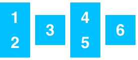

|||||
|:---|:---:|:---:|---:|
|alignItems|flex-start| enum ||
|| flex-end | enum ||
||center| enum ||
||stretch| enum ||
|||||
|alignSelf|auto(图中4)| enum ||
|| flex-start(图中1) | enum ||
||flex-end(图中2)| enum ||
||center(图中3)| enum ||
|| stretch(图中5) | enum ||
|||||
|flexDirection| row | enum ||
|| row-reverse | enum ||
|| column | enum ||
|| column-reverse | enum ||
|||||
| flexWrap | wrap | enum ||
|| nowrap | enum ||
|||||
| justifyContent | flex-start | enum ||
|| flex-end | enum ||
|| center | enum ||
|| space-between | enum ||
|| space-around | enum ||
|||||
| flex | flex |number||
|||||
|border|borderBottomWidth| number ||
|| borderLeftWidth| number ||
||borderRightWidth| number ||
|| borderTopWidth | number ||
|| borderWidth | number ||
|||||
|margin|marginBottom| number ||
||marginLeft| number ||
|| marginRight | number ||
|| marginTop | number ||
|| marginHorizontal| number |Setting marginHorizontal has the same effect as setting both marginLeft and marginRight.|
|| marginVertical | number | Setting marginVertical has the same effect as setting both marginTop and marginBottom. |
|| margin | number ||
|||||
|padding|paddingBottom| number ||
||paddingLeft| number ||
|| paddingRight | number ||
|| paddingTop | number ||
|| paddingHorizontal| number |Setting paddingHorizontal has the same effect as setting both paddingLeft and paddingRight.|
|| paddingVertical | number | Setting paddingVertical has the same effect as setting both paddingTop and paddingBottom. |
|| padding | number ||
|||||
| max | maxHeight |||
|| maxWidth |||
|||||
| min | minHeight |||
|| minWidth |||
|||||
| bottom ||||
|||||
| height ||||
|||||
| position | absolute |||
| | relative |||
|||||
| right ||||
|||||
| top ||||
|||||
| width ||||
|||||
| zIndex ||||

